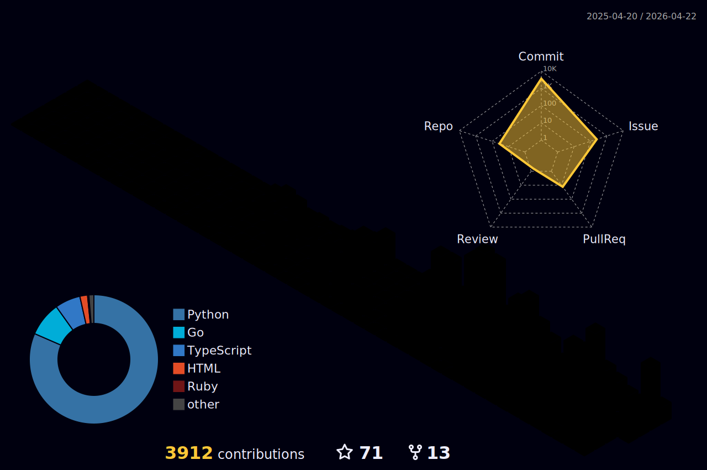

# 👋 你好！我是 gqy20

  

## 🧬 关于我 & 🛠️ 技术栈

| 🧬 关于我 | 🛠️ 技术栈 |
| --- | --- |
| 我是一名进化基因组学硕士生，热衷于开发生态学和生物信息学工具，让科学研究更高效、更智能。  **🔍 研究方向**： - 进化基因组学与分子生态学 - AI驱动的生物数据分析 - 科研效率工具开发  **🌱 当前状态**： - 📚 进化基因组学硕士在读 - 🚀 专注于AI与生物信息学交叉领域 - 💡 持续探索科研工具的创新应用 | **💻 编程语言**   **🤖 机器学习**   **🧬 生物信息学** BLAST • BEDTools • NCBI API • Bioconductor  **🔧 工具**  |

## 🌟 精选项目

<!-- 此部分由GitHub Actions自动更新，请勿手动编辑 -->
<!-- 上次更新时间: 2026/1/1 18:30:43 -->

<table width="100%" style="table-layout: fixed;">
<tr>
<td align="center" width="50%" style="padding: 15px; border: 1px solid #30363d; border-radius: 6px; margin: 5px; background-color: #0d1117;"><h3><a href="https://github.com/gqy20/gqy20.github.io" style="color: #58a6ff; text-decoration: none;">gqy20.github.io</a></h3>
个人网页

  

<a href="https://home.gqy20.top/" target="_blank" style="color: #58a6ff;">🏠 查看演示</a>
</td>
<td align="center" width="50%" style="padding: 15px; border: 1px solid #30363d; border-radius: 6px; margin: 5px; background-color: #0d1117;"><h3><a href="https://github.com/gqy20/flywheel" style="color: #58a6ff; text-decoration: none;">flywheel</a></h3>
flywheel 项目

  
</td>
</tr>
<tr>
<td align="center" width="50%" style="padding: 15px; border: 1px solid #30363d; border-radius: 6px; margin: 5px; background-color: #0d1117;"><h3><a href="https://github.com/gqy20/mind" style="color: #58a6ff; text-decoration: none;">mind</a></h3>
AI agents that collaborate to spark innovation

  
</td>
<td align="center" width="50%" style="padding: 15px; border: 1px solid #30363d; border-radius: 6px; margin: 5px; background-color: #0d1117;"><h3><a href="https://github.com/gqy20/quick-py" style="color: #58a6ff; text-decoration: none;">quick-py</a></h3>
现代化 Python 项目模板 - 使用 Copier 快速生成规范化的 Python 项目

  
</td>
</tr>
<tr>
<td align="center" width="50%" style="padding: 15px; border: 1px solid #30363d; border-radius: 6px; margin: 5px; background-color: #0d1117;"><h3><a href="https://github.com/gqy20/crawl-mcp" style="color: #58a6ff; text-decoration: none;">crawl-mcp</a></h3>
基于 crawl4ai 和 FastMCP 的 MCP 服务器，提供网页爬取和 AI 分析功能

  
</td>
<td align="center" width="50%" style="padding: 15px; border: 1px solid #30363d; border-radius: 6px; margin: 5px; background-color: #0d1117;"><h3><a href="https://github.com/gqy20/cc_plugins" style="color: #58a6ff; text-decoration: none;">cc_plugins</a></h3>
Specialized collection of development plugins desi...

  
</td>
</tr>
</table>

### 🎯 Profile Summary

<!-- 使用表格布局确保并排显示 -->
<table align="center" style="width: 100%; max-width: 700px; border-collapse: collapse; border-style: none; border-width: 0; margin-bottom: 15px; border-spacing: 0;">
  <tr>
    <td colspan="3" align="center" style="padding: 0; border-style: none; border-width: 0;">
      
    </td>
  </tr>
</table>

<table align="center" style="width: 100%; max-width: 700px; border-collapse: collapse; border-style: none; border-width: 0; border-spacing: 0;">
  <tr>
    <!-- 左侧：46% -->
    <td style="width: 46%; padding: 0; border-style: none; border-width: 0;">
      
    </td>
    <!-- 中间空隙：8% -->
    <td style="width: 8%; border-style: none; border-width: 0;">&nbsp;</td>
    <!-- 右侧：46% -->
    <td style="width: 46%; padding: 0; border-style: none; border-width: 0;">
      
    </td>
  </tr>
</table>

<!-- 第三行：另外两张卡片 -->
<table align="center" style="width: 100%; max-width: 700px; border-collapse: collapse; border-style: none; border-width: 0; border-spacing: 0; margin-top: 15px;">
  <tr>
    <!-- 左侧：46% -->
    <td style="width: 46%; padding: 0; border-style: none; border-width: 0;">
      
    </td>
    <!-- 中间空隙：8% -->
    <td style="width: 8%; border-style: none; border-width: 0;">&nbsp;</td>
    <!-- 右侧：46% -->
    <td style="width: 46%; padding: 0; border-style: none; border-width: 0;">
      
    </td>
  </tr>
</table>

<!-- 3D 贡献图 (全宽) -->

  

### 🐍 贡献活动

  

---

## 🌐 连接我

  

    
    
  

---

  🌱 持续学习，持续创造 | 用代码探索生命的奥秘

