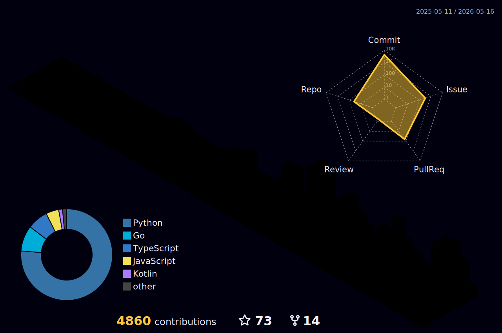

# 👋 你好！我是 gqy20

  

## 👨‍💻 关于我 & 🛠️ 技术栈

| 👨‍💻 关于我 | 🛠️ 技术栈 |
| --- | --- |
| 我是一名开发者，热衷于构建 AI 驱动的工具和开源项目，让工作更高效、更智能。  **🔍 关注领域**： - AI 工具与应用开发 - 开源项目与开发者体验 - 效率工具与自动化  **🌱 当前状态**： - 🚀 专注于 AI 与工具开发 - 💡 持续探索创新应用 | **💻 编程语言**   **🤖 机器学习**   **🔧 工具**  |

## 🌟 精选项目

<!-- 此部分由GitHub Actions自动更新，请勿手动编辑 -->
<!-- 上次更新时间: 2026/4/22 19:13:46 -->

<table width="100%" style="table-layout: fixed;">
<tr>
<td align="center" width="50%" style="padding: 15px; border: 1px solid #30363d; border-radius: 6px; margin: 5px; background-color: #0d1117;"><h3><a href="https://github.com/gqy20/gqy20.github.io" style="color: #58a6ff; text-decoration: none;">gqy20.github.io</a></h3>
个人网页

  

<a href="https://home.gqy20.top/" target="_blank" style="color: #58a6ff;">🏠 查看演示</a>
</td>
<td align="center" width="50%" style="padding: 15px; border: 1px solid #30363d; border-radius: 6px; margin: 5px; background-color: #0d1117;"><h3><a href="https://github.com/gqy20/homebrew-tap" style="color: #58a6ff; text-decoration: none;">homebrew-tap</a></h3>
Homebrew tap for gqy20 command-line tools

  
</td>
</tr>
<tr>
<td align="center" width="50%" style="padding: 15px; border: 1px solid #30363d; border-radius: 6px; margin: 5px; background-color: #0d1117;"><h3><a href="https://github.com/gqy20/zotero_cli" style="color: #58a6ff; text-decoration: none;">zotero_cli</a></h3>
AI 原生 Zotero 命行工具 — 让 AI 直接操作你的文献库

  
</td>
<td align="center" width="50%" style="padding: 15px; border: 1px solid #30363d; border-radius: 6px; margin: 5px; background-color: #0d1117;"><h3><a href="https://github.com/gqy20/TrendPluse" style="color: #58a6ff; text-decoration: none;">TrendPluse</a></h3>
GitHub 趋势智能分析工具 - 基于 AI 的开源项目趋势洞察

  

<a href="https://home.gqy20.top/TrendPluse/" target="_blank" style="color: #58a6ff;">🏠 查看演示</a>
</td>
</tr>
<tr>
<td align="center" width="50%" style="padding: 15px; border: 1px solid #30363d; border-radius: 6px; margin: 5px; background-color: #0d1117;"><h3><a href="https://github.com/gqy20/manim-agent" style="color: #58a6ff; text-decoration: none;">manim-agent</a></h3>
AI 数学动画视频自动生成 — 自然语言输入，端到端产出成品

  
</td>
<td align="center" width="50%" style="padding: 15px; border: 1px solid #30363d; border-radius: 6px; margin: 5px; background-color: #0d1117;"><h3><a href="https://github.com/gqy20/TrumanWorld" style="color: #58a6ff; text-decoration: none;">TrumanWorld</a></h3>
🎭 楚门的世界 AI 版 | 在这个小镇里，AI 居民们不知道自己是 AI。你是导演，只能观察和创...

  
</td>
</tr>
</table>

### 🎯 Profile Summary

<!-- 使用表格布局确保并排显示 -->
<table align="center" style="width: 100%; max-width: 700px; border-collapse: collapse; border-style: none; border-width: 0; margin-bottom: 15px; border-spacing: 0;">
  <tr>
    <td colspan="3" align="center" style="padding: 0; border-style: none; border-width: 0;">
      
    </td>
  </tr>
</table>

<table align="center" style="width: 100%; max-width: 700px; border-collapse: collapse; border-style: none; border-width: 0; border-spacing: 0;">
  <tr>
    <!-- 左侧：46% -->
    <td style="width: 46%; padding: 0; border-style: none; border-width: 0;">
      
    </td>
    <!-- 中间空隙：8% -->
    <td style="width: 8%; border-style: none; border-width: 0;">&nbsp;</td>
    <!-- 右侧：46% -->
    <td style="width: 46%; padding: 0; border-style: none; border-width: 0;">
      
    </td>
  </tr>
</table>

<!-- 第三行：另外两张卡片 -->
<table align="center" style="width: 100%; max-width: 700px; border-collapse: collapse; border-style: none; border-width: 0; border-spacing: 0; margin-top: 15px;">
  <tr>
    <!-- 左侧：46% -->
    <td style="width: 46%; padding: 0; border-style: none; border-width: 0;">
      
    </td>
    <!-- 中间空隙：8% -->
    <td style="width: 8%; border-style: none; border-width: 0;">&nbsp;</td>
    <!-- 右侧：46% -->
    <td style="width: 46%; padding: 0; border-style: none; border-width: 0;">
      
    </td>
  </tr>
</table>

<!-- 3D 贡献图 (全宽) -->

  

### 🐍 贡献活动

  

---

## 🌐 连接我

  

    
    
    
    
    
  

---

  🌱 持续学习，持续创造

